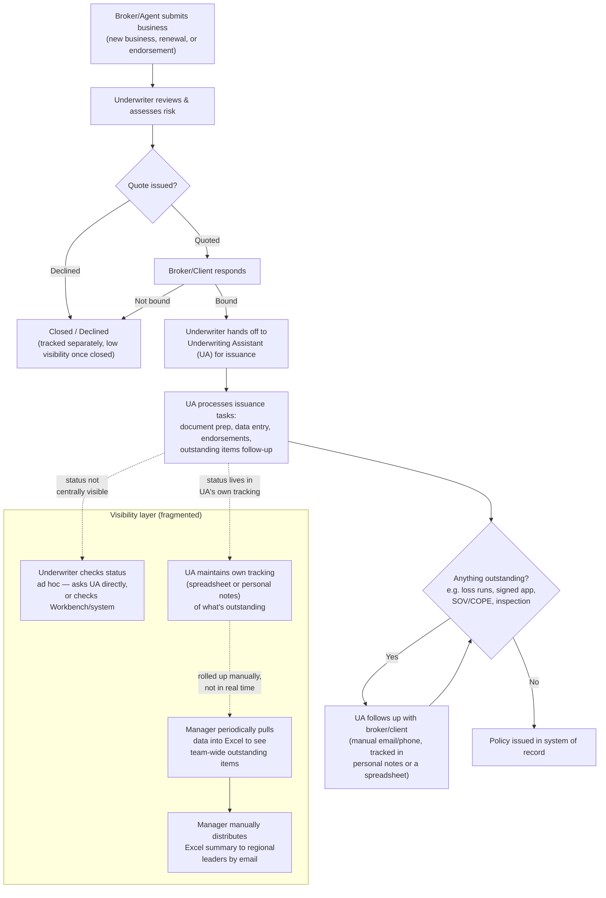

# Current-State Workflow: Policy Issuance & Visibility

This map reflects a generalized commercial underwriting policy issuance workflow, informed by professional experience working inside commercial underwriting operations. It is written to illustrate a **common industry pattern**, not any single employer's proprietary process, and it deliberately stays at the level of roles and handoffs rather than system-specific steps.

## Workflow

## Roles in This Workflow

| Role | What they do | What they need to see |
|---|---|---|
| **Broker/Agent** | Submits business, responds to quotes, supplies outstanding items | Status of their submission (largely external to this case study) |
| **Underwriter** | Assesses risk, quotes, binds, hands off to UA, remains accountable for the account relationship | What's still outstanding on their book; what needs their decision or attention today |
| **Underwriting Assistant (UA)** | Executes issuance tasks, chases outstanding items, processes endorsements | Their own queue, prioritized by aging and deadline |
| **Underwriting Manager** | Oversees a team of underwriters/UAs, reports up on team performance | Team-wide outstanding volume, aging, and bottlenecks |
| **Regional Leader** | Oversees multiple teams/managers, wants portfolio-level visibility | Roll-up of outstanding work and risk across teams/regions |

## Where Visibility Breaks Down

The transaction itself moves through a fairly standard path (submit → quote → bind → issue). The friction is not in the underwriting decision — it's in **knowing where every open item stands without asking someone or rebuilding a report by hand**:

1. **The underwriter can't see UA-managed issuance status in one place.** Once a policy is bound and handed to the UA, day-to-day status often lives in the UA's own tracking method, not a shared, real-time view.
2. **The UA's tracking is personal, not standardized.** Different UAs may track outstanding items differently, making it hard to roll up consistently across a team.
3. **Team- and region-level visibility requires manual work.** A manager assembling an outstanding-items view for regional leaders typically pulls data into Excel and distributes it — a snapshot that is stale the moment it's sent.
4. **There is no shared definition of "what needs attention."** Aging, priority, and outstanding-item status are judgment calls made informally, not a consistent, visible standard.

This is the gap ClearQueue is designed to close — see the [Future-State Workflow](future_state_process_map.md).
