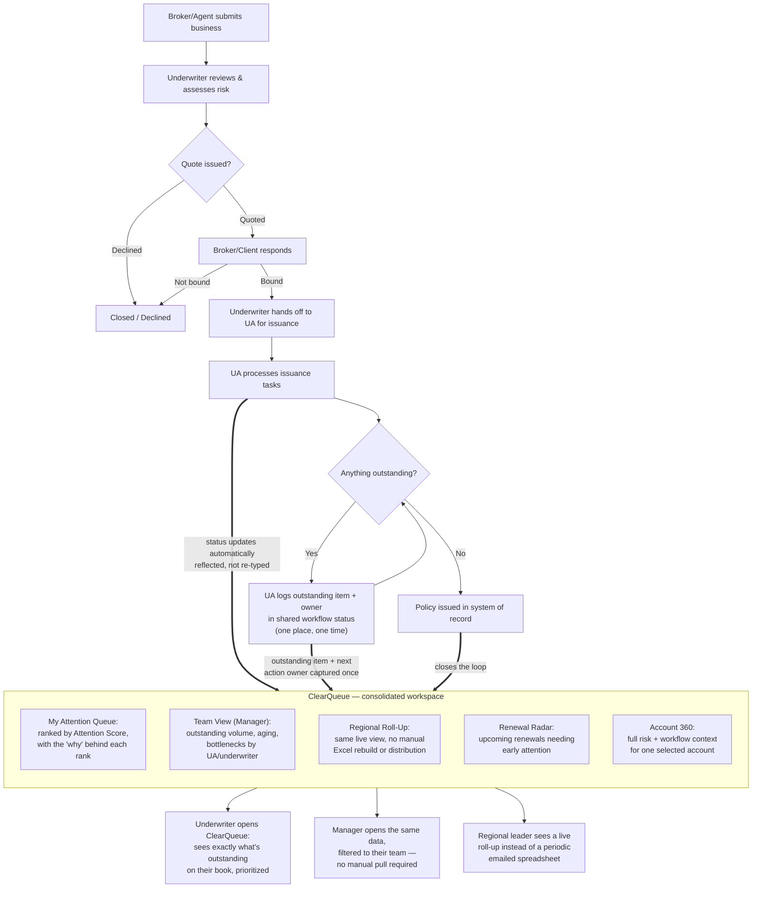

# Future-State Workflow: Policy Issuance & Visibility with ClearQueue

This shows how the same transaction workflow could look if a consolidated visibility layer — ClearQueue — sat on top of existing systems (Workbench, tracking spreadsheets, SharePoint, internal underwriting systems) instead of requiring people to manually reassemble status information.

**Important:** The underlying issuance workflow itself does not change. ClearQueue does not replace how business is quoted, bound, or issued — it replaces *how people find out what's happening* with that work. This is a visibility and workflow-awareness layer, not a new system of record.

## Workflow

## What Changes vs. Current State

| Current State | Future State with ClearQueue |
|---|---|
| Underwriter asks the UA or checks multiple systems to learn status | Underwriter opens one queue view scoped to their own book |
| Each UA tracks outstanding items their own way | Outstanding item + next-action owner captured in one shared, structured place |
| Manager manually pulls data into Excel for regional reporting | Manager and regional leader view the same live roll-up — no manual extract/distribute cycle |
| "What needs attention" is a judgment call, inconsistently applied | A transparent Attention Score (see [Attention Score Model](../analysis/attention_score_model.md)) is calculated the same way for everyone, with the reason always visible |
| Renewal follow-up depends on someone remembering to check | A dedicated renewal view surfaces upcoming renewals before they become urgent |

## What Does *Not* Change (Deliberately)

- ClearQueue is **not** a new policy administration or issuance system — issuance still happens in existing systems.
- It does **not** remove human judgment from underwriting decisions.
- It does **not** assume every existing tool disappears — SharePoint, Workbench, and internal systems remain the systems of record; ClearQueue is a consolidated *view* into their status.

See the [Proposed Solution](../README.md#proposed-solution) and [Requirements Matrix](../requirements/requirements_matrix.md) for how these changes map to specific features.
